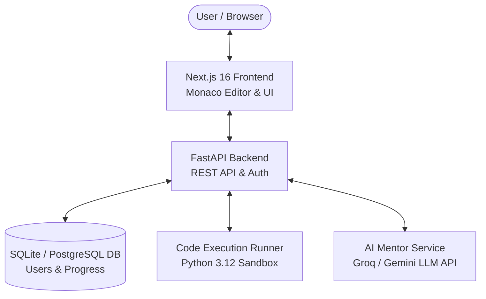
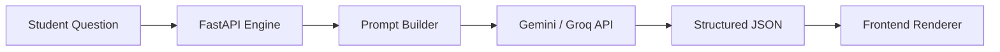

# ⚡ Python Quest — Gamified Data Structures & Algorithms Platform

[](https://github.com/Spidey173/Python)
[](https://nextjs.org/)
[](https://react.dev/)
[](https://fastapi.tiangolo.com/)
[](https://python.org/)
[](LICENSE)
[](https://python-frontend-ruby.vercel.app/)
[](https://github.com/Spidey173/Python/pulls)

**Python Quest** is an interactive, beginner-friendly coding platform designed to help students and freshers learn Data Structures & Algorithms (DSA) through hands-on practice, simple AI explanations, and interview Q&As.

---

## 🔗 Live Demo
- 🌐 **Frontend App**: [https://python-frontend-ruby.vercel.app/](https://python-frontend-ruby.vercel.app/)
- ⚡ **Backend API**: [https://python-7pu9.vercel.app/](https://python-7pu9.vercel.app/)
- 📚 **Swagger API Docs**: [https://python-7pu9.vercel.app/api/docs](https://python-7pu9.vercel.app/api/docs)

---

## 🖼️ Platform Screenshots

### 1. Main Dashboard


### 2. Curriculum Explorer


### 3. Coding Workspace & AI Assistant


### 4. Progress Analytics


---

## 📐 Architecture & System Design



### Why this Architecture?
- **Next.js 16**: Handles fast UI rendering, client-side state, and Monaco editor integration.
- **FastAPI**: Exposes high-performance async REST APIs with automatic OpenAPI schema validation.
- **SQLite / PostgreSQL**: Stores persistent user profiles, solved status, streaks, and XP points.
- **Execution Runner**: Isolates and safely executes user Python code against test suites with strict execution quotas.
- **AI Service**: Generates instant hints, code explanations, and debugging feedback.

---

## 🤖 AI Mentor Flow



---

## 📁 Folder Structure

```text
Python/
├── frontend/                  # Next.js 16 Web Application
│   ├── src/
│   │   ├── app/              # App Router Pages (Dashboard, Curriculum, Challenge)
│   │   ├── components/       # UI Components (Editor, Chatbot, Interview Panel, Modals)
│   │   ├── hooks/            # Custom React Hooks
│   │   └── lib/              # API Client, Auth Context & Utilities
│   ├── public/               # Static Assets
│   └── package.json
│
└── backend/                   # FastAPI Backend Service
    ├── app/
    │   ├── ai/               # Copilot & LLM Integrations (Groq / Gemini / Copilot)
    │   ├── routers/          # API Route Endpoints (Auth, Challenges, Execution)
    │   ├── models.py         # SQLAlchemy Database Models
    │   ├── schemas.py        # Pydantic Schemas & Validation
    │   └── main.py           # FastAPI Application Entry Point
    ├── tests/                # Pytest Backend Unit & Integration Tests
    └── requirements.txt
```

---

## 🚀 Cloud Deployment

- 🌐 **Frontend**: Hosted on **Vercel** ([python-frontend-ruby.vercel.app](https://python-frontend-ruby.vercel.app/))
- ⚡ **Backend API**: Hosted on **Vercel** ([python-7pu9.vercel.app](https://python-7pu9.vercel.app/))
- 🗄️ **Database**: **SQLite** / **Neon PostgreSQL**
- 🤖 **AI Engine**: **Google Gemini** / **Groq**
- 🔄 **CI/CD**: **GitHub Actions** / Vercel Automated Deployments

---

## 🌟 Key Features

- 🎯 **High-Frequency DSA Programs**: Structured topics covering Strings, Two Pointers, Sliding Window, Linked Lists, Trees, and Graphs.
- 🤖 **Friendly AI Mentor**:
  - Responds politely to greetings without dumping big code blocks unnecessarily.
  - Gives hints, code solutions, or simple bug explanations when asked.
- 🎙️ **Spoken Interview Q&As**: Practical interview questions and answers for each problem to help freshers prepare for technical interviews.
- ⚡ **Instant Code Runner**: Run Python code with test cases directly in the browser.
- 🎮 **Gamification & Auth**: XP points, levels, daily streaks, persistent user login sessions, and profile tracking.

---

## 🛠️ Tech Stack

- **Frontend**: Next.js 16, React 19, Tailwind CSS, Monaco Code Editor
- **Backend**: Python 3.12, FastAPI, SQLAlchemy
- **Database**: SQLite (Local Dev) / PostgreSQL (Neon)
- **Testing**: Pytest & Next.js build verification

---

## 📚 API Documentation

FastAPI automatically generates interactive documentation:
- **Swagger UI**: [https://python-7pu9.vercel.app/api/docs](https://python-7pu9.vercel.app/api/docs)
- **ReDoc**: [https://python-7pu9.vercel.app/api/redoc](https://python-7pu9.vercel.app/api/redoc)

### Main API Routes:
- `POST /api/auth/register` — Create a user account
- `POST /api/auth/login` — Sign in with username & password
- `GET  /api/challenges/chapters` — Fetch DSA chapters & levels
- `POST /api/execution/run` — Run Python code against test cases
- `POST /api/ai/tutor` — Ask the AI tutor for hints or explanations

---

## 🧪 Testing & Verification

### Backend Verification
- ✓ **Authentication**: Registration, password verification, JWT token issuance
- ✓ **Code Execution**: Python sandbox execution & test case assertions
- ✓ **AI APIs**: Groq, Gemini & Copilot LLM prompt formatting & fallback
- ✓ **Progress**: Solved status tracking & XP calculation
- ✓ **User Profile**: Streak computation & leaderboard placement

```bash
cd backend
PYTHONPATH=. pytest
```

### Frontend Verification
- ✓ **Production Build**: Clean Next.js Turbopack compilation
- ✓ **Linting**: ESLint checks passed
- ✓ **Type Safety**: 100% Strict TypeScript type checks

```bash
cd frontend
npm run build
```

---

## 📜 Commit History Standards

The repository follows clean conventional commit guidelines:
- `feat`: New features (e.g., `feat(ui): add interview Q&A panel`)
- `fix`: Bug fixes (e.g., `fix(ai): friendly greeting response for chat`)
- `style`: Formatting & UI changes (e.g., `style(chatbot): increase font size by 1px`)
- `docs`: Documentation updates (e.g., `docs: update README with architecture and live demo details`)

---

## 🚀 Quick Local Setup Guide

1. **Clone the project**:
   ```bash
   git clone https://github.com/Spidey173/Python.git
   cd Python
   ```
2. **Start Backend**:
   ```bash
   cd backend
   python3 -m venv venv
   source venv/bin/activate
   pip install -r requirements.txt
   uvicorn app.main:app --reload --port 8000
   ```
3. **Start Frontend**:
   ```bash
   cd ../frontend
   npm install
   npm run dev
   ```
