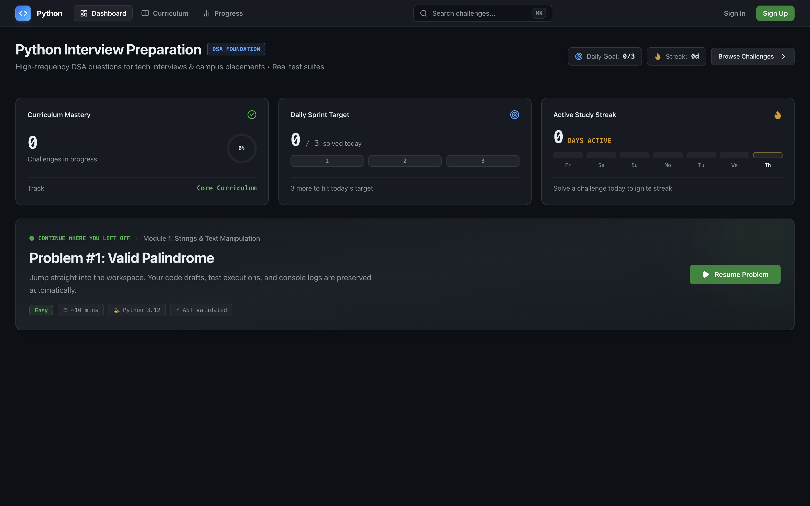
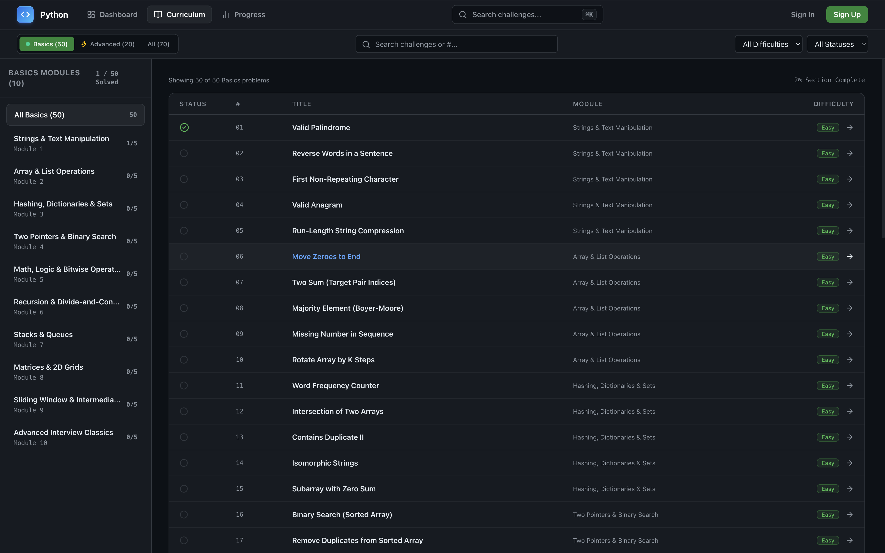
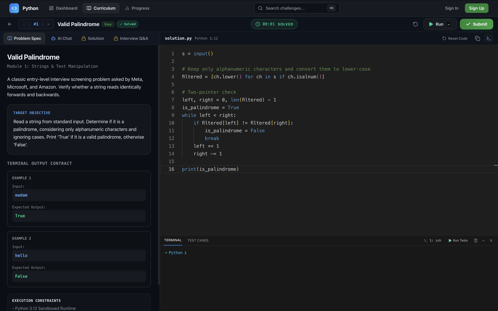
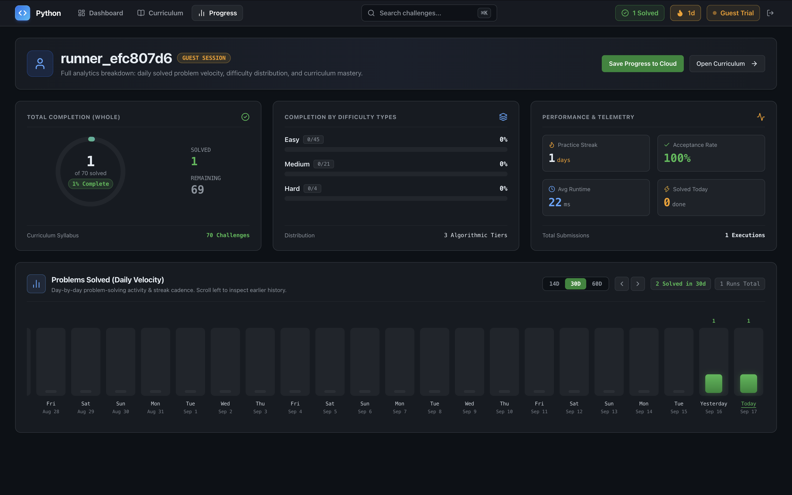
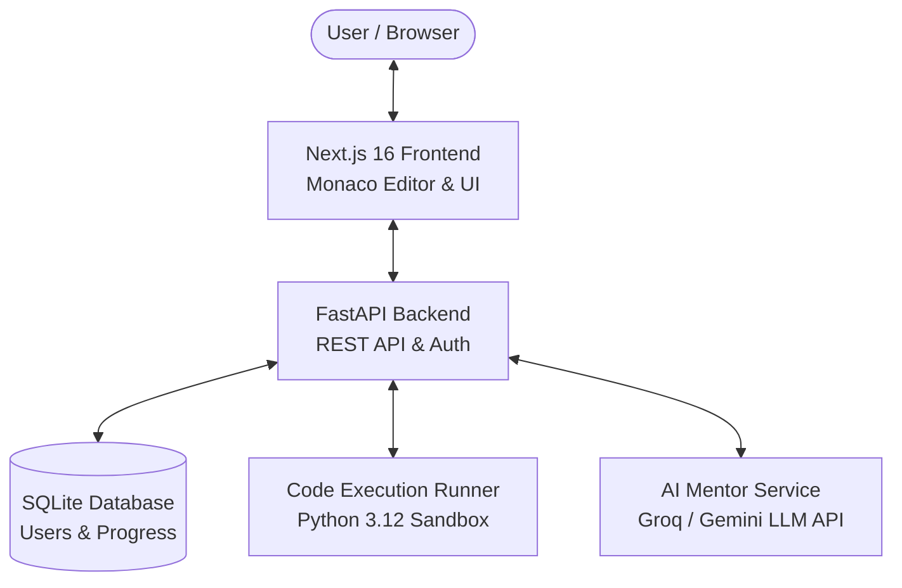

# ⚡ Python Quest — Gamified Data Structures & Algorithms Platform

[](https://nextjs.org/)
[](https://fastapi.tiangolo.com/)
[](https://python.org/)
[](LICENSE)

**Python Quest** is an interactive, beginner-friendly coding platform designed to help students and freshers learn Data Structures & Algorithms (DSA) through hands-on practice, simple AI explanations, and interview Q&As.

---

## 🔗 Live Demo
- **Frontend App**: `http://localhost:3000` (Local Dev)
- **Backend API Docs (Swagger UI)**: `http://localhost:8000/api/docs`

---

## 🖼️ Platform Screenshots

### 1. Main Dashboard


### 2. Curriculum Explorer


### 3. Coding Workspace & AI Assistant


### 4. Progress Analytics


---

## 📐 Architecture Diagram



---

## 🌟 Key Features

- 🎯 **High-Frequency DSA Programs**: Structured topics covering Strings, Two Pointers, Sliding Window, Linked Lists, Trees, and Graphs.
- 🤖 **Friendly AI Mentor**:
  - Responds politely to greetings without dumping big code blocks unnecessarily.
  - Gives hints, code solutions, or simple bug explanations when asked.
- 🎙️ **Spoken Interview Q&As**: Practical interview questions and answers for each problem to help freshers prepare for technical interviews.
- ⚡ **Instant Code Runner**: Run Python code with test cases directly in the browser.
- 🎮 **Gamification & Auth**: XP points, levels, daily streaks, persistent user login sessions, and profile tracking.

---

## 🛠️ Tech Stack

- **Frontend**: Next.js 16, React 19, Tailwind CSS, Monaco Code Editor
- **Backend**: Python 3.12, FastAPI, SQLAlchemy
- **Database**: SQLite (Local Dev) / PostgreSQL
- **Testing**: Pytest & Next.js build verification

---

## 📚 API Documentation

FastAPI automatically generates interactive documentation:
- **Swagger UI**: `http://localhost:8000/api/docs`
- **ReDoc**: `http://localhost:8000/api/redoc`

### Main API Routes:
- `POST /api/auth/register` — Create a user account
- `POST /api/auth/login` — Sign in with username & password
- `POST /api/auth/guest` — Start a quick guest trial session
- `GET  /api/challenges/chapters` — Fetch DSA chapters & levels
- `POST /api/execution/run` — Run Python code against test cases
- `POST /api/ai/tutor` — Ask the AI tutor for hints or explanations

---

## 🧪 Tests & Verification

### Run Backend Tests:
```bash
cd backend
PYTHONPATH=. pytest
```

### Run Frontend Build Check:
```bash
cd frontend
npm run build
```

---

## 📜 Commit History Standards

The repository follows clean conventional commit guidelines:
- `feat`: New features (e.g., `feat(ui): add interview Q&A panel`)
- `fix`: Bug fixes (e.g., `fix(ai): friendly greeting response for chat`)
- `style`: Formatting & UI changes (e.g., `style(chatbot): increase font size by 1px`)
- `docs`: Documentation updates (e.g., `docs: update README with architecture and live demo details`)

---

## 🚀 Quick Setup Guide

1. **Clone the project**:
   ```bash
   git clone https://github.com/Spidey173/Python.git
   cd Python
   ```
2. **Start Backend**:
   ```bash
   cd backend
   python3 -m venv venv
   source venv/bin/activate
   pip install -r requirements.txt
   uvicorn app.main:app --reload --port 8000
   ```
3. **Start Frontend**:
   ```bash
   cd ../frontend
   npm install
   npm run dev
   ```
